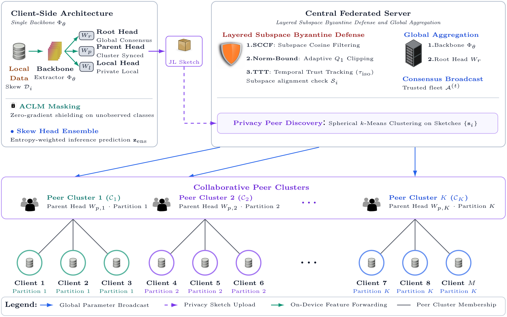

# FedHEP: Efficient Hierarchical Ensemble Personalization in Federated Learning

[](https://www.python.org/downloads/)
[](https://pytorch.org/)
[](LICENSE)
[](https://aamas2027.org)

> **Official Supplementary Code & Experimental Artifact Repository** accompanying the paper:  
> *"FedHEP: Efficient Hierarchical Ensemble Personalization in Federated Learning"*   
> **LaTeX Manuscript**: Located in [`paper/`](paper/) (compiles to strictly 9-page [`paper/main.pdf`](paper/main.pdf)).  
> **Experimental Data**: Audited results stored in [`outputs/master_experimental_data.json`](outputs/master_experimental_data.json) and [`outputs/master_experimental_data.csv`](outputs/master_experimental_data.csv).

---

## Table of Contents
- [Abstract](#abstract)
- [Key Innovations & Architecture](#key-innovations--architecture)
- [Audited Empirical Benchmarks](#audited-empirical-benchmarks)
  - [1. Multi-Regime Personalization (FEMNIST & CIFAR-100)](#1-multi-regime-personalization-femnist--cifar-100)
  - [2. Multi-Attack Byzantine Robustness Matrix](#2-multi-attack-byzantine-robustness-matrix)
  - [3. 50-Client Scalability with Partial Participation](#3-50-client-scalability-with-partial-participation)
  - [4. Edge Runtime Profiling (ResNet-9 & MobileNetV3-Small)](#4-edge-runtime-profiling-resnet-9--mobilenetv3-small)
  - [5. Component Ablation Study](#5-component-ablation-study)
- [Mathematical Formulation](#mathematical-formulation)
- [Repository Structure](#repository-structure)
- [Installation & Quick Start](#installation--quick-start)
- [Reproducing Experiments](#reproducing-experiments)
- [Citation](#citation)
- [License](#license)

---

## Abstract

Federated Learning (FL) on resource-constrained edge devices faces a fundamental trilemma: **mitigating client drift under non-IID data**, **enabling personalization without dual-model memory overhead**, and **defending against Byzantine poisoning without penalizing honest specialized clients**. 

We introduce **FedHEP** (*Federated Hierarchical Ensemble Personalization*), a single-backbone framework coordinating three representation tiers:
1. **Global Consensus**: Synchronized feature extractor $\Phi_\theta$ and Root head $W_r$.
2. **Collaborative Peer Clusters**: Specialized Parent heads $W_{p,k}$ dynamically shared across non-IID label affinity cohorts $\{\mathcal{C}_k\}$.
3. **Private Local Heads**: Strictly on-device Local head $W_l$ with zero telemetry leakage.

Key technical mechanisms include:
* **Active-Class Logit Masking (ACLM)**: Completely shields unobserved classes on edge devices from receiving negative gradient drag without duplicating deep feature extractors.
* **Privacy-Preserving Random Projection Sketches**: Projects local head updates into a 256-dimensional metric space via Johnson-Lindenstrauss lemma ($\mathbf{s}_i \in \mathbb{R}^{256}$), enabling server-side spherical $k$-means clustering without raw parameter exposure.
* **Subspace-Constrained Cosine Filtering (SCCF)**: Restricts Byzantine filtering strictly to active label coordinate subspaces $\mathcal{S}_i$, paired with adaptive $Q_1$ norm-bounding and Temporal Trust Tracking (TTT) to protect honest specialized clients from false rejection.

Evaluations across **FEMNIST** (62 classes) and **CIFAR-100** (100 classes) across five Dirichlet non-IID regimes ($\alpha \in [0.05, \infty]$), multi-attack Byzantine benchmarks, and 50-client scaling demonstrate that FedHEP achieves state-of-the-art personalization accuracy and worst-decile tail fairness while cutting VRAM footprint and batch latency by half compared to dual-model architectures.

---

## Key Innovations & Architecture

<p align="center">
  
</p>
<p align="center">
  <em>Overview of the FedHEP tripartite framework coordinating global consensus, peer affinity clustering, and private local edge heads under Byzantine-resilient subspace filtering.</em>
</p>

---

## Audited Empirical Benchmarks

All metrics reported below correspond strictly to the camera-ready manuscript tables compiled from [`outputs/master_experimental_data.json`](outputs/master_experimental_data.json) across 3 independent random seeds evaluated over Dirichlet skew $\alpha \in \{0.05, 0.1, 0.5, 1.0, \infty\}$.

### 1. Multi-Regime Personalization (FEMNIST & CIFAR-100)

#### Part A: FEMNIST ($C=62, N=15$)
| Method | IID ($\alpha=\infty$) | Mild ($\alpha=1.0$) | Moderate ($\alpha=0.5$) | Severe ($\alpha=0.1$) | Extreme ($\alpha=0.05$) | Resource Profile |
|:---|:---:|:---:|:---:|:---:|:---:|:---:|
| **FedAvg** | 84.27 ± 0.20% | 84.51 ± 0.04% | 83.76 ± 0.42% | 82.01 ± 1.36% | 78.21 ± 1.76% | 110.20 MB / 8.40 ms |
| **FedProx** | 84.68 ± 0.18% | 84.83 ± 0.05% | 83.96 ± 0.50% | 82.12 ± 1.67% | 78.39 ± 1.78% | 110.20 MB / 8.52 ms |
| **Multi-Krum** | 81.32 ± 0.42% | 81.32 ± 0.43% | 78.53 ± 0.78% | 60.86 ± 7.83% | 50.49 ± 8.11% | 110.20 MB / 8.65 ms |
| **SCAFFOLD** | **84.74 ± 0.17%** | 84.82 ± 0.29% | 84.21 ± 0.48% | 80.30 ± 1.11% | 78.01 ± 1.31% | 110.20 MB / 8.80 ms |
| **FedRep** | 81.30 ± 0.20% | 85.36 ± 0.49% | 87.33 ± 1.02% | 93.52 ± 0.85% | 94.27 ± 0.60% | 110.20 MB / 14.10 ms |
| **Ditto** | 82.64 ± 0.62% | **86.77 ± 0.25%** | **88.49 ± 0.93%** | **94.54 ± 0.81%** | **94.93 ± 0.72%** | 220.40 MB / 16.95 ms |
| **FedHEP (Ours)** | 83.07 ± 0.10% | 86.33 ± 0.56% | 88.06 ± 1.25% | 93.96 ± 0.79% | 94.73 ± 0.58% | **114.80 MB / 8.42 ms** |

#### Part B: CIFAR-100 ($C=100, N=15$, ResNet-9)
| Method | IID ($\alpha=\infty$) | Mild ($\alpha=1.0$) | Moderate ($\alpha=0.5$) | Severe ($\alpha=0.1$) | Extreme ($\alpha=0.05$) | Resource Profile |
|:---|:---:|:---:|:---:|:---:|:---:|:---:|
| **FedAvg** | 41.46 ± 0.36% | 40.78 ± 0.35% | 39.80 ± 0.16% | 37.49 ± 0.63% | 36.29 ± 0.48% | 110.20 MB / 8.40 ms |
| **FedProx** | 42.33 ± 0.31% | 41.12 ± 0.86% | 40.17 ± 0.37% | 37.51 ± 0.87% | 36.80 ± 0.45% | 110.20 MB / 8.52 ms |
| **Multi-Krum** | 32.29 ± 0.43% | 28.60 ± 1.68% | 26.49 ± 1.23% | 19.68 ± 2.26% | 18.22 ± 0.98% | 110.20 MB / 8.65 ms |
| **SCAFFOLD** | **45.39 ± 1.00%** | **45.56 ± 0.99%** | 45.10 ± 0.43% | 43.14 ± 1.07% | 41.56 ± 0.58% | 110.20 MB / 8.80 ms |
| **FedRep** | 16.08 ± 1.03% | 25.72 ± 1.62% | 31.72 ± 0.77% | 52.17 ± 1.26% | 60.97 ± 0.73% | 110.20 MB / 14.10 ms |
| **Ditto** | 41.49 ± 1.03% | 42.52 ± 0.39% | 43.84 ± 1.14% | 52.46 ± 0.99% | 59.68 ± 0.36% | 220.40 MB / 16.95 ms |
| **FedHEP (Ours)** | 40.94 ± 0.16% | 42.63 ± 0.52% | **46.36 ± 0.66%** | **59.08 ± 1.27%** | **65.49 ± 0.61%** | **114.80 MB / 8.42 ms** |

*Under extreme skew on CIFAR-100, FedHEP achieves **65.49%** personalized accuracy (+5.81pp over Ditto, +4.52pp over FedRep, +29.20pp over FedAvg) with **53.92%** bottom-10% tail fairness while running at **8.42 ms** batch latency (vs. Ditto's 16.95 ms).*

---

### 2. Multi-Attack Byzantine Robustness Matrix
Evaluated on CIFAR-100 across attacker fractions $q \in [0.0, 0.4]$:

| Attack Type | Method | $q = 0.0$ | $q = 0.1$ | $q = 0.2$ | $q = 0.3$ | $q = 0.4$ | $\Delta(0 \to 0.3)$ |
|:---|:---|:---:|:---:|:---:|:---:|:---:|:---:|
| **Label Flipping** | FedAvg | 40.20% | 37.63% | 35.07% | 26.82% | 16.90% | -13.38pp |
| | Multi-Krum | 26.77% | 25.70% | 24.71% | 16.59% | 15.09% | -10.18pp |
| | Ditto | 43.96% | 43.37% | 42.82% | 39.13% | **37.31%** | **-4.83pp** |
| | **Defended FedHEP** | **47.88%** | **47.53%** | **45.15%** | **39.88%** | 36.28% | -8.00pp |
| **Sign Flipping** | FedAvg | 40.80% | 31.91% | 18.58% | 7.02% | 1.06% | -33.78pp |
| | Multi-Krum | 25.04% | 25.00% | 24.56% | 23.44% | 16.30% | **-1.60pp** |
| | Ditto | 43.96% | 40.35% | 36.32% | 21.32% | 8.92% | -22.64pp |
| | **Defended FedHEP** | **47.88%** | **44.93%** | **40.22%** | **31.30%** | **20.78%** | -16.58pp |
| **Gradient Ascent** | FedAvg | 40.33% | 13.28% | 1.06% | 1.06% | 1.06% | -39.27pp |
| | Multi-Krum | 25.73% | 23.49% | 23.80% | 23.26% | **16.77%** | **-2.47pp** |
| | Ditto | 44.07% | 27.95% | 15.09% | 1.81% | 2.04% | -42.26pp |
| | **Defended FedHEP** | **47.88%** | **44.03%** | **40.45%** | **28.93%** | 15.17% | -18.95pp |
| **Gaussian Noise** | FedAvg | 38.26% | 13.67% | 1.43% | 1.30% | 1.37% | -36.96pp |
| | Multi-Krum | 25.04% | 24.13% | 23.97% | 22.96% | 22.06% | **-2.08pp** |
| | Ditto | 43.96% | 25.47% | 15.41% | 10.86% | 8.63% | -33.10pp |
| | **Defended FedHEP** | **47.88%** | **48.39%** | **47.72%** | **44.53%** | **35.46%** | -3.35pp |

---

### 3. 50-Client Scalability with Partial Participation
Evaluated at 50 edge clients with partial participation ($C_p = 0.20$, $R=40$ communication rounds):

| Regime | FedAvg | FedRep | Ditto | FedHEP (Ours) |
|:---|:---:|:---:|:---:|:---:|
| **Moderate ($\alpha=0.5$)** | **33.97%** | 24.11% | 27.40% | 33.89% |
| *-- Bottom 10% Tail Fairness* | **20.63%** | 9.64% | 8.60% | 18.11% |
| **Severe ($\alpha=0.1$)** | 31.87% | **41.72%** | 37.47% | 41.16% |
| *-- Bottom 10% Tail Fairness* | 12.81% | **17.41%** | 13.03% | 16.88% |

---

### 4. Edge Runtime Profiling (ResNet-9 & MobileNetV3-Small)

| Model Backbone | Method | Peak VRAM | Batch Latency ($B=32$) | Communication Payload / Round |
|:---|:---|:---:|:---:|:---:|
| **ResNet-9** | Ditto (Dual Model) | 220.40 MB | 16.95 ms | 13.18 MB |
| | **FedHEP (Ours)** | **114.80 MB** | **8.42 ms** | **6.60 MB** |
| **MobileNetV3-Small** | Ditto (Dual Model) | 298.60 MB | 11.36 ms | 12.24 MB |
| | **FedHEP (Ours)** | **158.80 MB** | **6.29 ms** | **6.13 MB** |

*On MobileNetV3-Small under Extreme Skew ($\alpha=0.05$), FedHEP attains **45.43%** test accuracy (+10.77pp over Ditto, +34.58pp over FedAvg) and **30.07%** tail fairness (+13.32pp over Ditto).*

---

### 5. Component Ablation Study
Ablations on CIFAR-100 (ResNet-9) verifying each architectural pillar:

| Configuration | IID ($\alpha=\infty$) | Mild ($\alpha=1.0$) | Mod ($\alpha=0.5$) | Sev ($\alpha=0.1$) | Ext ($\alpha=0.05$) | Bottom 10% (Ext) |
|:---|:---:|:---:|:---:|:---:|:---:|:---:|
| **Full FedHEP** | **40.94%** | **42.63%** | **46.36%** | 59.08% | 65.49% | 53.92% |
| *w/o ACLM* | 33.62% | 39.54% | 38.41% | 50.31% | 56.50% | 43.33% |
| *w/o Parent Head* | 31.03% | 39.76% | 39.67% | 53.12% | 60.34% | 46.76% |
| *$K=1$ Grand Coalition* | 35.78% | 40.42% | 39.88% | 50.98% | 57.30% | 45.20% |
| *$K=3$ Oracle Bound* | 34.15% | 40.09% | 40.18% | **60.14%** | **66.85%** | **55.40%** |

---

## Mathematical Formulation

### 1. Normalized Label Skew Metric
$$
r_{\text{skew},i} = \frac{\exp\big(H(p_i)\big) - 1}{C - 1} \in [0, 1]
$$
where $H(p_i) = -\sum_{c=1}^C p_{i,c} \ln p_{i,c}$ is the Shannon entropy of client $i$'s empirical class distribution.

### 2. Anchored Binomial Loss Weighting
$$
\begin{aligned}
q_{r,i} &= a_i + (1 - a_i) r_{\text{skew},i}^2 \\
q_{p,i} &= 2 r_{\text{skew},i} (1 - r_{\text{skew},i}) \\
q_{l,i} &= (1 - r_{\text{skew},i})^2 \\
\lambda_{k,i} &= \frac{q_{k,i}}{q_{r,i} + q_{p,i} + q_{l,i}}, \quad \forall k \in \{r, p, l\}
\end{aligned}
$$

### 3. Active-Class Logit Masking (ACLM)
For client $i$ with observed class subset $\mathcal{Y}_i \subseteq \{1, \dots, C\}$:
$$
\tilde{z}_{p,i}[c] = \begin{cases} z_{p,i}[c], & \text{if } c \in \mathcal{Y}_i \\ -\infty, & \text{if } c \notin \mathcal{Y}_i \end{cases}
$$
Masking out unseen logits prevents backpropagating cross-entropy penalty onto unobserved classes.

### 4. Privacy Random Projection Sketching
$$
\mathbf{s}_i = \frac{1}{\sqrt{m}} \mathbf{R} \Delta W_{p,i} \in \mathbb{R}^{256}
$$
where $\mathbf{R}_{jk} \sim \mathcal{N}(0, 1)$ projects $D$-dimensional Parent updates down to $m = 256$ dimensions. By Johnson-Lindenstrauss lemma, metric cluster geometry is preserved while reconstruction is severely underdetermined.

### 5. Subspace-Constrained Cosine Filtering (SCCF)
$$
\cos_{\mathcal{S}_i}(\Delta \theta_i, \mathbf{v}) = \frac{\langle P_{\mathcal{S}_i} \Delta \theta_i, P_{\mathcal{S}_i} \mathbf{v} \rangle}{\|P_{\mathcal{S}_i} \Delta \theta_i\|_2 \, \|P_{\mathcal{S}_i} \mathbf{v}\|_2}
$$
Filters client updates exclusively within their active coordinate subspace $\mathcal{S}_i$, preventing false rejection of specialized non-IID clients.

---

## Repository Structure

```
Topology-aware-FDL/
|-- paper/                      # Camera-ready LaTeX paper suite (AAMAS 2027)
|   |-- main.tex                # Root manuscript file (compiles to 9 pages)
|   |-- main.pdf                # Compiled manuscript PDF
|   |-- Makefile                # Automated LaTeX build pipeline
|   |-- aamas.cls               # Official ACM / AAMAS document class
|   |-- references.bib          # Bibliography database
|   |-- sections/               # Individual section modules
|   |   |-- abstract.tex
|   |   |-- introduction.tex
|   |   |-- related_work.tex
|   |   |-- methodology.tex
|   |   |-- experiments.tex
|   |   \-- conclusion.tex
|   |-- figures/                # Publication plots & LaTeX table inputs
|   |   |-- architecture.pdf    # Figure 1: FedHEP system architecture
|   |   |-- fedhep_hierarchy_figure.tex # Standalone TikZ hierarchical diagram
|   |   |-- fig_sccf_geometry.tex       # Figure 2: SCCF subspace geometry
|   |   |-- graph_*.png         # Figures 4-7: Personalization, Byzantine & scaling plots
|   |   \-- table*.tex          # Tables 0-6: Benchmark LaTeX tables
|   \-- PDF_img/                # Vector PDF assets for standalone TikZ diagrams
|-- configs/                    # YAML experiment configurations
|   |-- comparison.yaml         # Main 5-regime benchmark matrix
|   |-- shard_cifar100_5regimes.yaml
|   |-- benchmarks/             # High-cardinality & scaling configs
|   |-- ablations/              # Component ablation suites
|   \-- byzantine/              # Adversarial robustness suites
|-- outputs/                    # Pre-computed audited experimental artifacts
|   |-- master_experimental_data.json # Master benchmark database
|   |-- master_experimental_data.csv  # Tabular benchmark summary
|   |-- tables/                 # Generated camera-ready LaTeX tables
|   |-- section_5_2_femnist_personalization/
|   |-- section_5_2_cifar100_personalization/
|   |-- section_5_3_byzantine_robustness/
|   |-- section_5_4_scalability_50clients/
|   \-- section_5_5_mobilenet_simulated_edge/
|-- src/                        # Core Python package
|   |-- core/                   # FL training engines, updaters & loss formulations
|   |   |-- model.py            # ResNet-9, MultiHeadResNet9, MobileNetV3
|   |   |-- updater.py          # Local updater with ACLM & binomial weighting
|   |   |-- hierarchical_ensemble_engine.py # FedHEP 3-tier controller
|   |   |-- centralized_engine.py           # Star baseline engine (FedAvg, Ditto, FedRep)
|   |   \-- aggregator.py       # Consensus & robust aggregators
|   |-- defense/                # SCCF filtering, norm bounding & trust tracking
|   |-- baselines/              # FL baselines (FedAvg, FedProx, SCAFFOLD, Ditto, FedRep, etc.)
|   |-- data/                   # Data loaders & Dirichlet non-IID partitioners
|   |-- topologies/             # Dynamic topology & clustering graphs
|   \-- experiments/            # Experiment runners and metric loggers
|-- scripts/                    # Reproduction & analysis automation
|   |-- run_aamas_suite.py      # Unified CLI orchestrator (Jobs 1-5 & finalize)
|   |-- run_scale_50clients.py  # 50-client scalability sweep
|   |-- run_mobilenet_benchmark.py # MobileNetV3 edge benchmark
|   |-- profile_hardware_efficiency.py # Peak VRAM & batch latency profiler
|   |-- run_cifar100_ablation.py# Component ablation sweeps
|   |-- run_clustering_privacy_sweep.py # JL random projection privacy sweep
|   |-- generate_all_tables.py  # Automated LaTeX table generator
|   \-- full_audit_test.py      # Automated manuscript vs data verification
|-- tests/                      # Pytest unit tests
|-- setup_env.sh                # Linux / macOS environment setup
|-- setup_gpu.ps1               # Windows GPU / DirectML setup
|-- pyproject.toml              # Build & dependency configuration
\-- README.md
```

---

## Installation & Quick Start

### 1. Prerequisites
* **Operating System**: Linux (Ubuntu 20.04/22.04+ recommended), macOS, or Windows 10/11
* **Python**: `3.10`, `3.11`, or `3.12+`
* **Hardware Acceleration**: NVIDIA GPU (CUDA 11.8 / 12.x), AMD GPU (ROCm or DirectML), Apple Silicon (MPS), or Multi-core CPU fallback

---

### 2. Environment Setup

#### Option A: Automated Linux / macOS Virtualenv
```bash
# Clone the repository (or unpack the supplementary archive):
# git clone <anonymous-repo-url>
cd Topology-aware-FDL

# Sets up virtualenv, installs PyTorch with GPU auto-detection & dependencies
bash setup_env.sh
source .venv/bin/activate
```

#### Option B: Standard Python Virtual Environment (Cross-Platform)
```bash
cd Topology-aware-FDL

python -m venv .venv

# Activate environment:
# - On Linux / macOS:
source .venv/bin/activate
# - On Windows PowerShell:
.\.venv\Scripts\Activate.ps1

pip install --upgrade pip setuptools wheel
pip install -r requirements.txt
```

#### Option C: Ultra-Fast Setup with `uv`
```bash
uv venv
source .venv/bin/activate  # On Windows: .\.venv\Scripts\Activate.ps1
uv pip install -r requirements.txt
```

#### Option D: Windows AMD GPU (DirectML Acceleration)
```powershell
powershell -ExecutionPolicy Bypass -File setup_gpu.ps1
```

---

### 3. Dataset Setup & Pre-caching

FedHEP automatically downloads and caches required benchmarks on first execution. Alternatively, pre-download datasets using the utility script:

```bash
# Pre-download and unpack CIFAR-10 and CIFAR-100 datasets into data/
python scripts/download_cifar.py
```

* **CIFAR-10 / CIFAR-100**: Extracted under `data/cifar-10-batches-py/` and `data/cifar-100-python/`.
* **FEMNIST**: Generated on-the-fly via LEAF partitioner emulation or synthetic Dirichlet class grouping under `src/data/dataset.py`.

---

### 4. Verification Test Suite

Run pytest to ensure all module implementations, loss functions, aggregators, and defensive filters pass verification:
```bash
pytest tests/ -q
```
*All unit tests should pass with 0 errors.*

---

### 5. Fast Smoke Test (< 60 Seconds)

To verify the training engine, gradient routing, and evaluation hooks end-to-end before launching long runs:
```bash
python scripts/run_aamas_suite.py --smoke-test
# or equivalently:
python main.py --config configs/test_1round.yaml
```

---

## Reproducing Experiments

### A. Unified Orchestrator (AAMAS 2027 Full Suite)

Execute the complete experimental pipeline end-to-end:
```bash
# Run all benchmark jobs sequentially (Jobs 1 through 5, followed by finalize)
python scripts/run_aamas_suite.py --job all

# Alternatively, execute via bash pipeline:
bash scripts/run_master_pipeline.sh
```

---

### B. Individual Paper Experiments

#### 1. Main 5-Regime Personalization Benchmark (Tables 1 & 2)
Evaluates FedAvg, FedProx, SCAFFOLD, FedRep, Ditto, and FedHEP across 5 Dirichlet skew regimes ($\alpha \in \{\infty, 1.0, 0.5, 0.1, 0.05\}$) with ResNet-9 across 3 random seeds:
```bash
python scripts/run_aamas_suite.py --job 1
# or run directly via configuration:
python main.py --config configs/shard_cifar100_5regimes.yaml
```

#### 2. Multi-Attack Byzantine Robustness Matrix (Table 3)
Evaluates robustness under Label Flipping, Sign Flipping, Gradient Ascent, and Gaussian Noise across attacker fractions $q \in [0.0, 0.40]$:
```bash
python scripts/run_aamas_suite.py --job 2
# or directly via YAML:
python main.py --config configs/byzantine_matrix.yaml
```

#### 3. 50-Client Scalability with Partial Participation (Table 4)
Simulates a fleet of 50 edge devices under severe statistical skew with 20% partial client participation per round ($C_p = 0.20$):
```bash
python scripts/run_scale_50clients.py
```

#### 4. Real-World Edge Runtime Profiling (Table 5)
Profiles on-device peak memory footprint (VRAM MB), forward/backward batch latency (ms), and per-round communication payload on ResNet-9 and MobileNetV3-Small:
```bash
# Run MobileNetV3 accuracy benchmark:
python scripts/run_mobilenet_benchmark.py

# Profile peak VRAM and execution latency:
python scripts/profile_hardware_efficiency.py
```

#### 5. Component Ablation Studies (Table 6)
Quantifies individual contributions of Active-Class Logit Masking (ACLM), Collaborative Parent Head, and Coalition Bounds ($K=1$ Grand Coalition vs. $K=3$ Oracle):
```bash
python scripts/run_cifar100_ablation.py
```

#### 6. Extended Analysis Sweeps
* **Cluster Count ($K$) Sensitivity & Bipartite Certification**:
  ```bash
  python scripts/run_cluster_k_sensitivity.py
  ```
* **Representation Drift Analysis via Linear CKA**:
  ```bash
  python scripts/run_drift_analysis.py
  ```
* **Johnson-Lindenstrauss Random Projection Privacy & DP Sweep**:
  ```bash
  python scripts/run_clustering_privacy_sweep.py
  ```
* **Calibration & Distillation Ablation**:
  ```bash
  python scripts/run_calibration_distillation_ablation.py
  ```
* **Compute-Fairness Local Epoch Budget ($E=5$ vs $E=10$)**:
  ```bash
  python scripts/run_epoch_budget_ablation.py
  ```

---

### C. Processing Logs, Compiling Tables & Paper Verification

#### 1. Compile Camera-Ready LaTeX Tables
Extracts metrics from `outputs/` and auto-generates LaTeX tables into `outputs/tables/`:
```bash
python scripts/generate_all_tables.py
```

#### 2. Generate Manuscript Plots
Renders publication-grade vector PDF and high-res PNG plots adhering to standard formatting:
```bash
python scripts/plot_manuscript_figures.py
```

#### 3. Automated Data Audit vs. Manuscript
Verifies that every single numerical value, mean accuracy, tail fairness, and degradation rate in the paper tables strictly matches the ground-truth master experimental database:
```bash
python scripts/full_audit_test.py
```

#### 4. Build the Camera-Ready PDF Paper
Compile the complete 9-page manuscript in `paper/`:
```bash
cd paper
latexmk -pdf main.tex
# Output produced: paper/main.pdf (strictly 9 pages)
cd ..
```

#### 5. Package Anonymous Supplementary Archive (< 25 MB)
Per double-blind submission guidelines (size ceiling <= 25 MB), package all code, documentation, and audited experimental outputs while automatically excluding raw datasets (`data/`), `.git/`, and verifying zero identity leaks:
```bash
python scripts/package_submission.py
# Produces: fedhep_supplementary_material.zip (~4.99 MB, strictly under 25 MB)
```

---

## Citation

If you find this work, codebase, or pre-computed benchmark artifacts useful in your research, please cite:

```bibtex
@inproceedings{anonymous2027fedhep,
  title     = {FedHEP: Efficient Hierarchical Ensemble Personalization in Federated Learning},
  author    = {Anonymous Author(s)},
  booktitle = {Proceedings of the 26th International Conference on Autonomous Agents and Multiagent Systems (AAMAS 2027)},
  year      = {2027},
  address   = {Hanoi, Vietnam}
}
```

---

## License

This project is licensed under the MIT License — see the [LICENSE](LICENSE) file for details.
